# Design Pattern课程笔记

## 项目简介

项目源码在src下，如果想查看具体某个模式的如何运行，只要在对应目录下找到Main类并运行main函数即可，比如查看

```
- src
	- behavioral
	- creation
	- structural
```


推荐书目： 《Design Patterns Element of Reusable Object-Oriented Software》 -- by GoF

UML: Unified Modeling Language 33min34s

## Behavioral Pattern 行为模式

### Memento Pattern 备忘录模式

问题再现：

假设有一个编辑器，我们该如何解决撤销（undo）的问题？


```java
public class Editor {
	private String content;
	// ...
	public undo(){
		// TODO
	}
}
```

1. 加一个变量`private String prevContent`，储存上次输入的值 -> 只能存储一次
2. 改为加一个列表`private List<String> prevContentList`，储存一系列值 -> 但是只能储存content变量的值
3. 增加一个类`public class EditorStatus` -> 违背了oop的SRP（Single Responsibility Principle）
4. 再增加一个新类`public class History` 


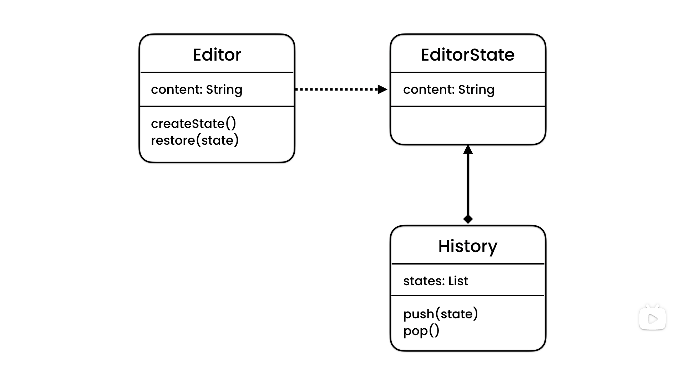


### State Pattern 状态模式

问题再现

1. 比如ps中对工具的选择，选择画笔或者框选工具，鼠标同样的操作，但是在画布上的行为不同
2. 同样的比如UIControl，可以有TextBox，ListBox等

我们需要遵守Open Closed Principle (Open for extension, Closed for modification)


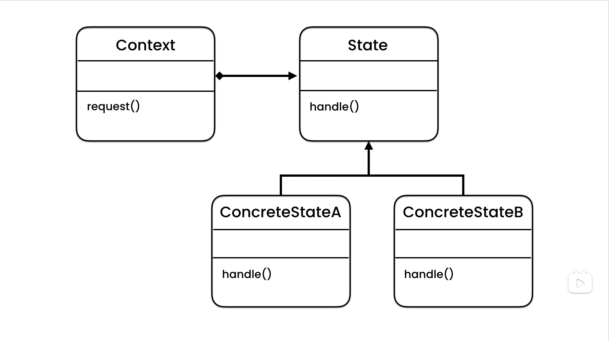

### Iterator Pattern 迭代器模式

应用：用于生成各种迭代器

下面的例子是手写迭代器的案例 ，一般来说，迭代器都是内部类实现的


### Strategy Pattern 战略模式

首先来看一组案例

ps: 感觉和前面的状态模式很相似

```java
public class ImageStorage {
	private String compressor;
	private String filter;

	public ImageStorage(String compressor, String filter) {
		this.compressor = compressor;
		this.filter = filter;
	}

	public void store(String fileName) {
		// JPEG, PNG, ...
		if (Objects.equals(compressor, "jpeg"))
			System.out.println("compressing using JPEG");
		else if (Objects.equals(compressor, "png"))
			System.out.println("compressing using PNG");

		// B&W, High Contrast, ...
		if (Objects.equals(filter, "b&w"))
			System.out.println("filtering using B&W");
		else if (Objects.equals(filter, "high-contrast"))
			System.out.println("filtering using high-contrast");
	}
}
```

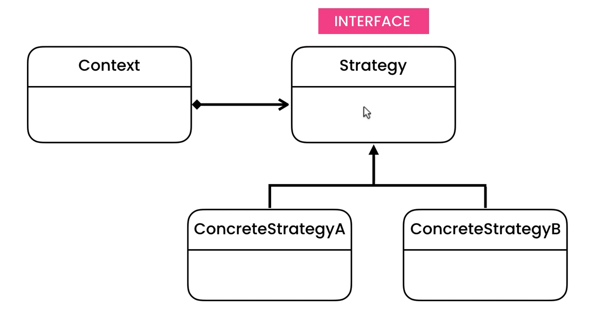

### Template Method Pattern 模板模式

可以看到，部分方法已经被抽象类实现，其实这个就是模板模式


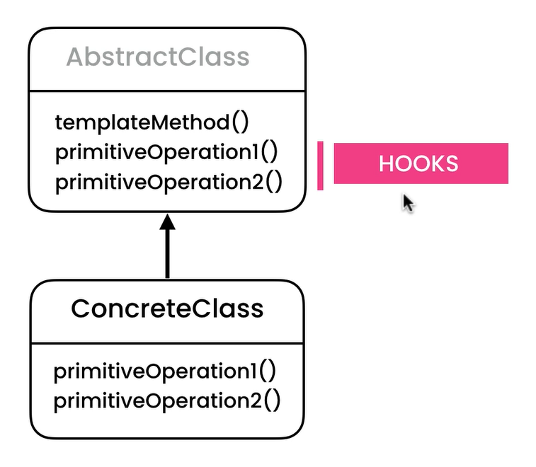

### Command Pattern 命令模式


#### 实践：包含撤销命令的设计


### Observer Pattern 观察者模式


mosh用图表举例，饼图会随着数据的变化而发生变化，有点像后台管理系统


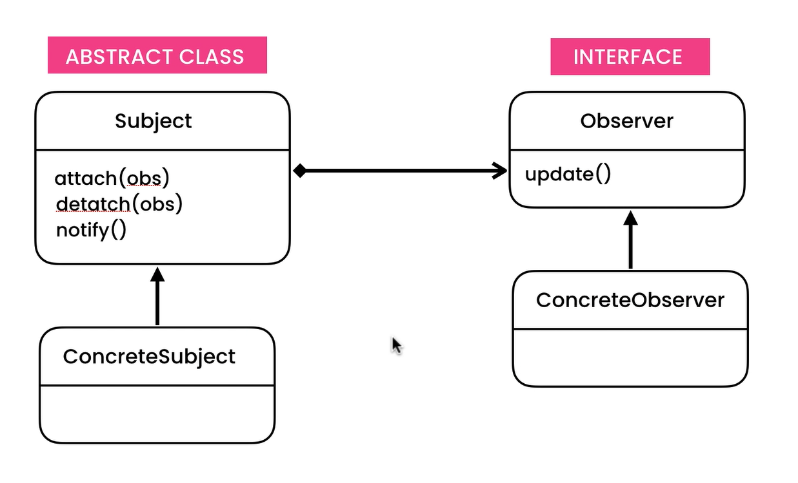

同时也可以叫Publisher - Subscriber 模式

#### 讨论如何传输数据

#### 推送模式

这样做的缺点是，我们预设了数据的类型，如果之后更改数据类型，就会发生错误

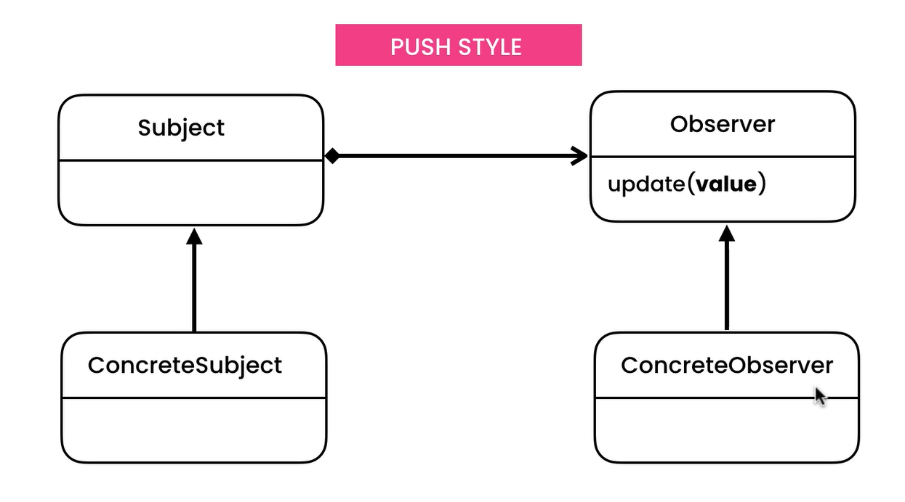

#### 拉取模式

从数据源拉取数据，但是这样做的缺点是增加了耦合


### Mediator Pattern 中介模式


上面的太过复杂

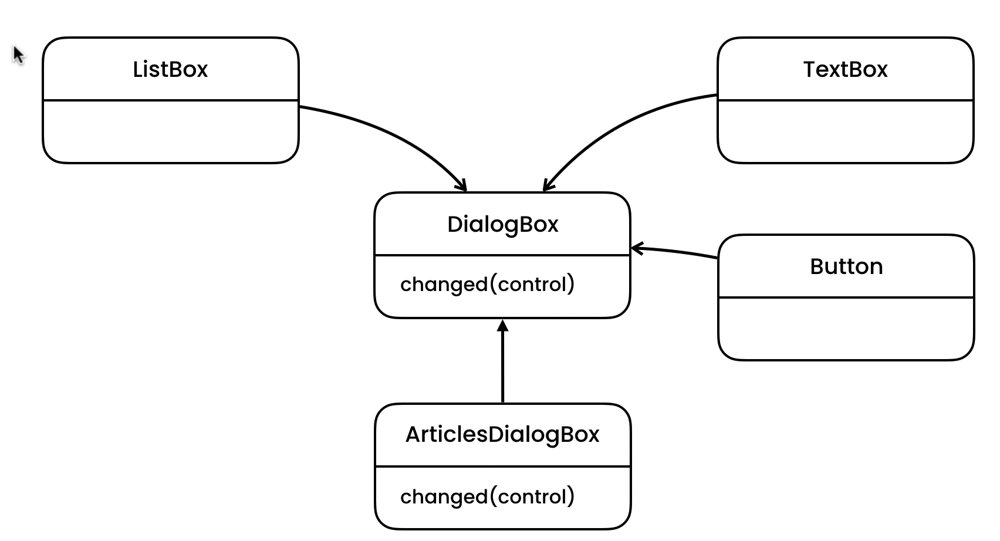

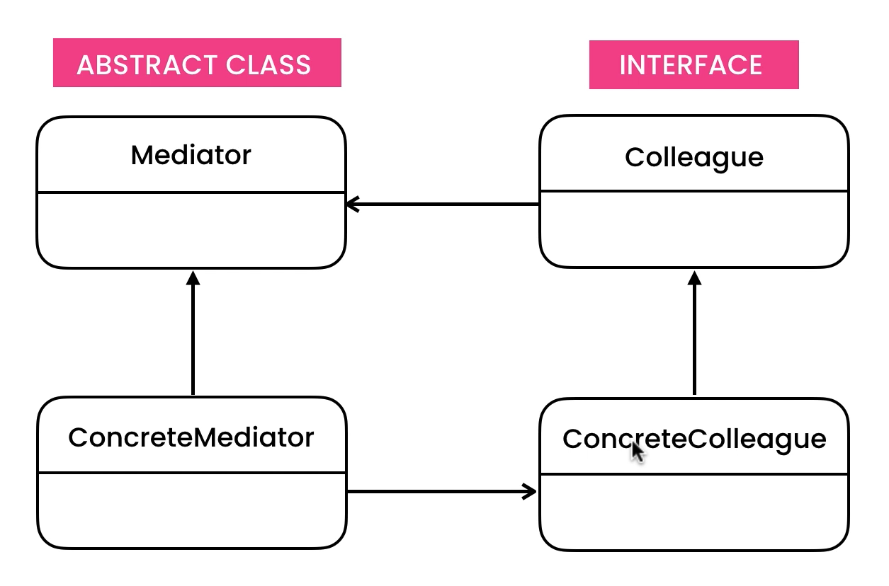

### Chain of Responsibility Pattern 责任链模式

比如我们要搭建一个web服务器


### Visitor Pattern 访问者模式

应用：比如vscode中标签高亮


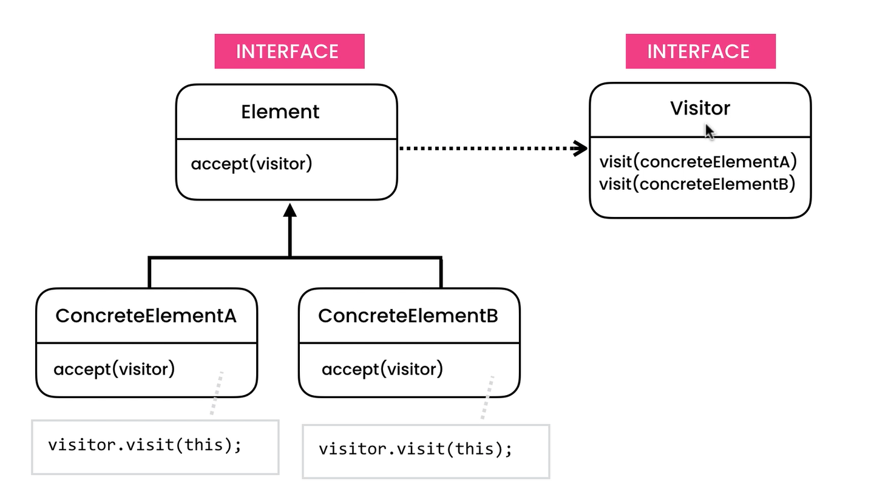

## Structural 结构型模式

### Composite Pattern 组合模式

PowerPoint中图形的组合


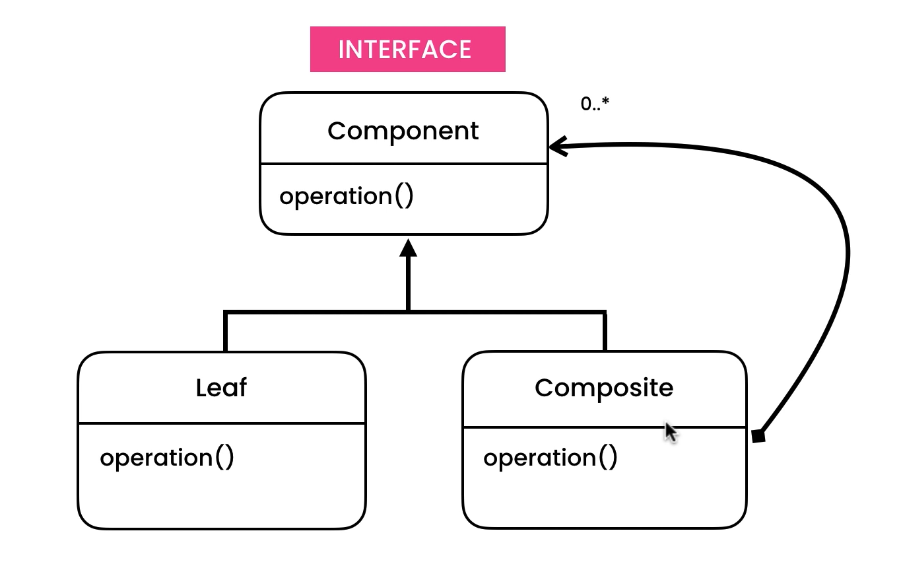

### Adaptor Pattern 适配器模式


### Decorator Pattern 装饰器模式


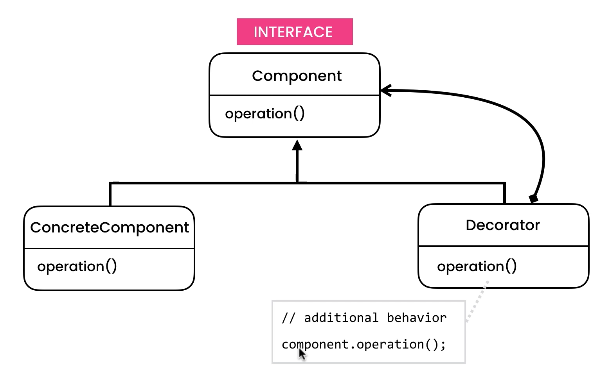 

### Facade Pattern 外观设计模式


### Flyweight Pattern 享元模式、飞锤模式

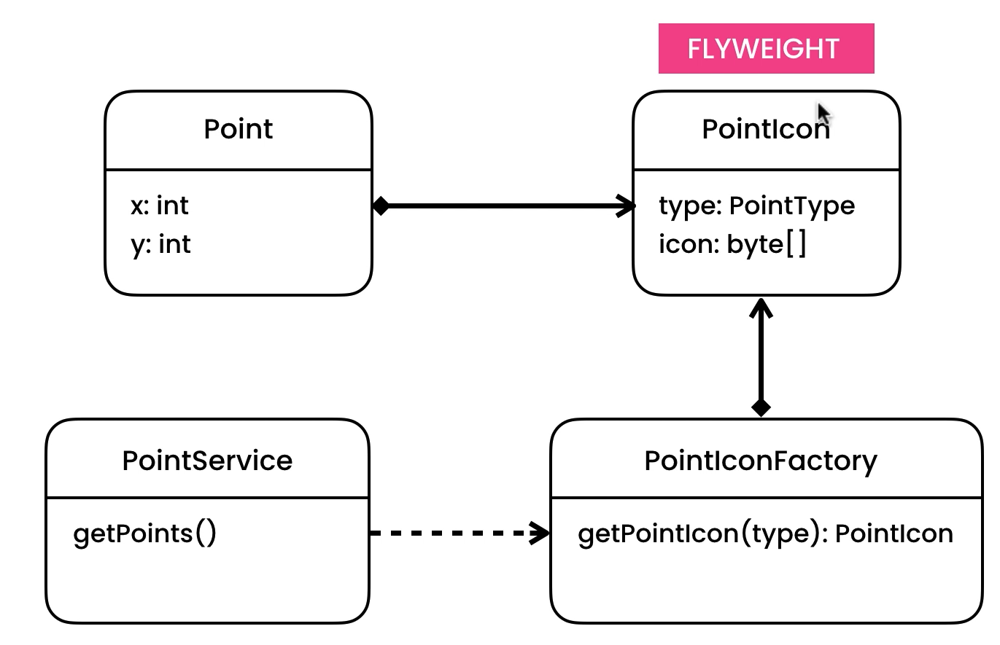

### Bridge Pattern 桥接模式

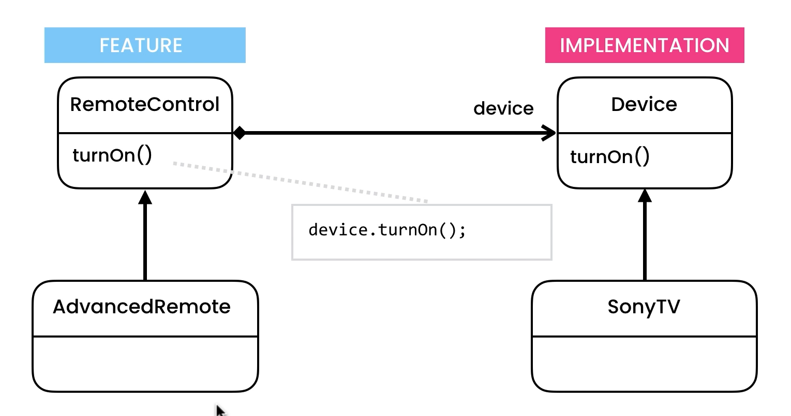

### Proxy Model 代理模式

主要是解决懒加载的问题


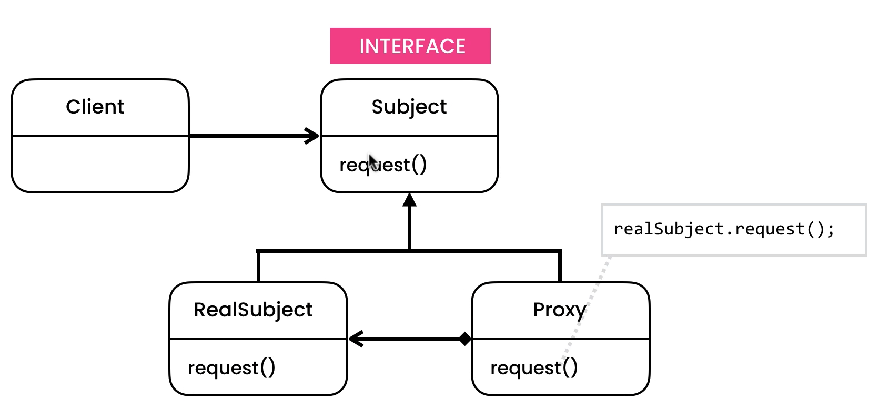

## Creational Pattern 创新型模式

### Prototype 原型

比如ppt中形状的创建，通过复制来生成新的对象

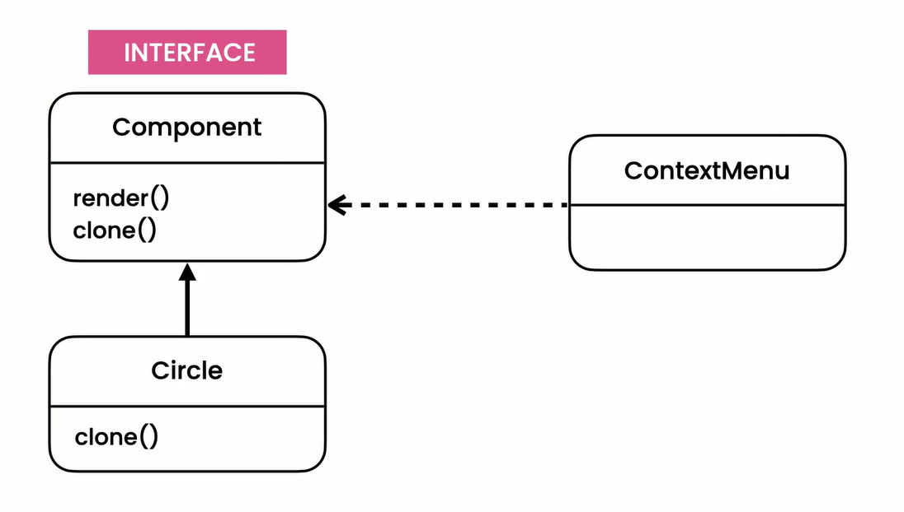

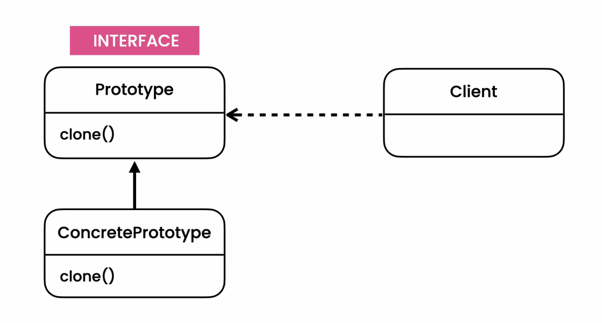

### Singleton 单例

### Factory Method 工厂方法

在Spring、Django中常用


### Abstract Factory 抽象工厂


### Builder 生成器

比如ppt导出成pdf，或者markdown导出成pdf


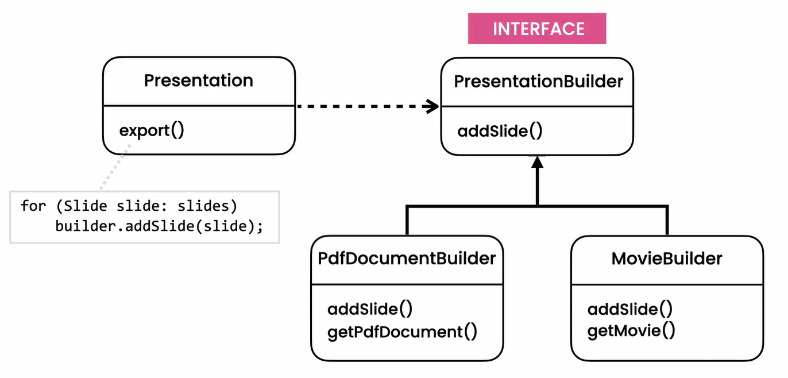

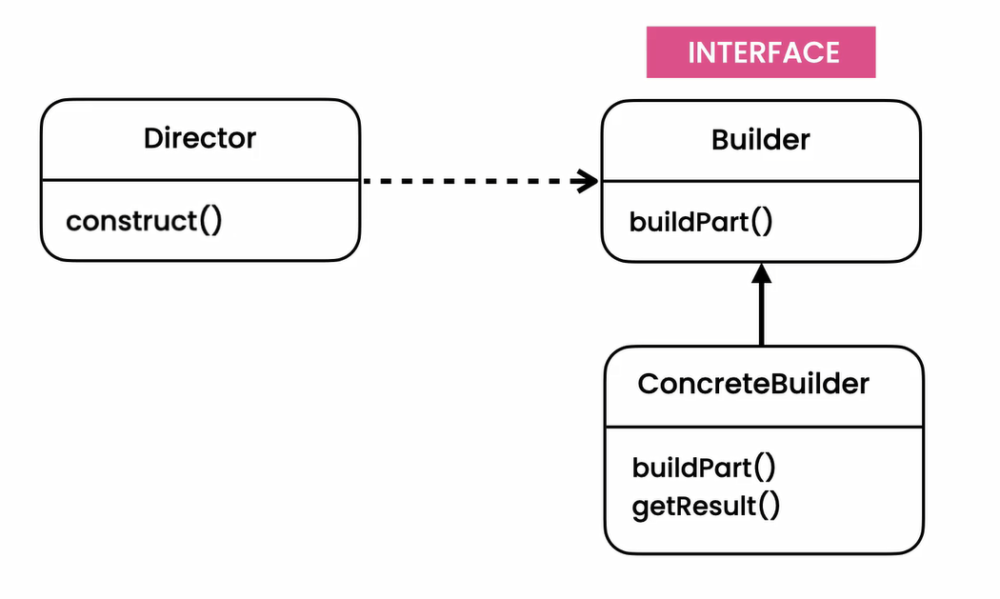