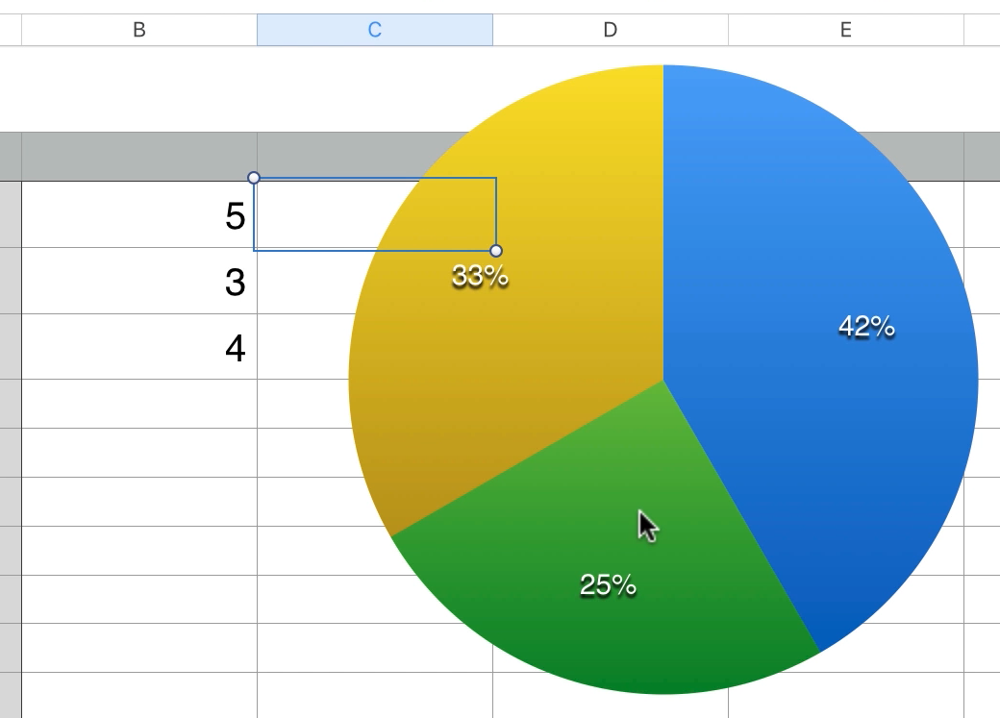
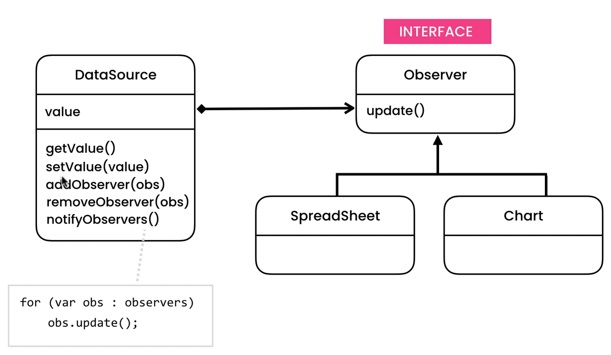
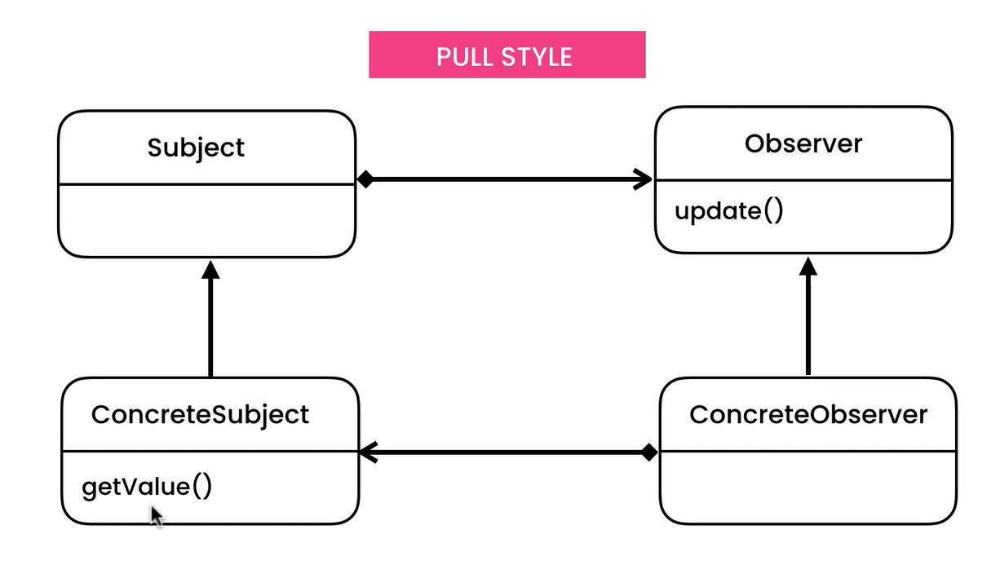

# Command Pattern 命令模式

#### 实践：包含撤销命令的设计

### Observer Pattern 观察者模式

mosh用图表举例，饼图会随着数据的变化而发生变化，有点像后台管理系统

同时也可以叫Publisher - Subscriber 模式

#### 讨论如何传输数据

#### 推送模式

这样做的缺点是，我们预设了数据的类型，如果之后更改数据类型，就会发生错误

#### 拉取模式

从数据源拉取数据，但是这样做的缺点是增加了耦合

